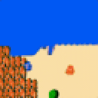
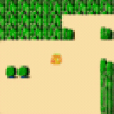
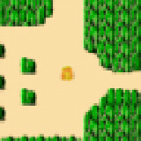

# hyrule-dreamer-wm — a neural world model that dreams *Legend of Zelda*

A **neural game engine** for NES *Legend of Zelda*. There is no emulator and no game
logic here — a diffusion **world model** takes a few seed frames plus your controller
inputs and **dreams the next frames**, one after another, entirely in a learned latent
space.

It's **ego-centric**: the world scrolls around Link as he moves. Seed it with a moment
of real gameplay, hold a direction, and it generates a coherent, controllable dream of
Hyrule.

> ⚠️ **Research artifact, not a finished game.** It produces coherent, controllable
> dreams of Hyrule for several seconds; it is not a pixel-faithful emulator and it
> drifts/diverges over long horizons. See [Limitations](#limitations).



*Live play — a person driving Link around the overworld with the keyboard. Seeded from one real frame; every frame after that is dreamed by the model in response to the input.*

---

## How it works

```
   your controller input
            │
            ▼
   ego world model ─► next latent ─► tokenizer ─► RGB frame
        ▲                 │                      (what you see)
        └── fed back in ──┘
          (receding horizon)
```

1. **Tokenizer.** A KL-VAE that compresses a 64×64 ego-centric frame into a small
   latent grid (32×32×16) and decodes it back. The world model only ever works on these
   latents; the tokenizer is frozen.
2. **World model.** A factorized space-time transformer (DiT-style) with **causal**
   temporal attention, trained with EDM diffusion. Causality is what makes it samplable
   online: frame *t* attends only to frames ≤ *t*, so it can roll forward one frame at a
   time under live actions. Action conditioning is per-frame (controller byte →
   embedding).
3. **Rollout.** Seed with `n_ctx` real latent frames, denoise the next frame
   conditioned on the context + action, append it, slide the window forward. Repeat.

## Showcase

All clips below are live, real-input play captured from the interactive harness —
no scripting, every frame generated by the model.

| | |
|---|---|
|  |  |
| Held against the world's edges — geometry phases and warps. An honest look at how the dream breaks down. | A normal stretch of live overworld play. |

## Quickstart

```bash
git clone https://github.com/blackfirebitcoin/hyrule-dreamer-wm
cd hyrule-dreamer-wm

# 1. install (torch first, matching your CUDA — see https://pytorch.org)
pip install torch --index-url https://download.pytorch.org/whl/cu121
pip install -r requirements.txt

# 2. fetch the weights (Release assets, ~80 MB)
bash weights/fetch_weights.sh

# 3. dream: walk DOWN for 6s, then UP for 6s, in one continuous rollout
python infer.py \
    --wm weights/hyrule_dreamer_wm.pt \
    --tokenizer weights/f4_ego_tokenizer.pt \
    --seed assets/seeds/overworld_00.pt \
    --actions "down:6,up:6" --fps 10 \
    --out out/walk_down_up.mp4
```

`--actions` is a comma list of `name:seconds` segments. Action names:
`noop a b select start up down left right`. A CUDA GPU is recommended; it will fall
back to CPU (slowly).

## Hardware requirements

Inference is light — this is a small model (~20 M params, 64×64 frames), nothing
like a modern LLM.

| | |
|---|---|
| **GPU** | Any recent NVIDIA CUDA GPU; **~2 GB VRAM** is plenty (RTX 20-series or newer is comfortable). |
| **CPU-only** | Works for `infer.py` (a 30 s clip takes minutes), but too slow for live play. |
| **Live play** (`play.py`) | A GPU is effectively required — expect **~10 fps** with DPM8 on a modern card (measured on an NVIDIA GB10 / DGX Spark). |
| **Disk** | ~80 MB model weights + your PyTorch/CUDA install. |
| **RAM** | A couple of GB. |
| **OS** | Linux or Windows with NVIDIA CUDA; macOS runs CPU-only (slow). |

No training is included in this release, so there are no large-scale GPU/storage
needs — this is inference only.

## Play it live

The hero/showcase clips above were all captured from the interactive harness — drive
the world model yourself with the keyboard and export a clip of your run:

```bash
bash run_play.sh           # serves http://localhost:9300
```

Then open **http://localhost:9300** and play:

- **Arrow keys / WASD** — move (the world dreams around Link as you go)
- **DPM8 / HEUN** — sampler toggle (DPM8 ≈ 10 fps on a modern GPU)
- **▦ SEEDS** — pick a start screen (real spawns + synthetic "stress" patterns)
- **✨ STABILIZE** — latent re-projection (drift damper)
- **⏺ SAVE 30s** — download the last 30 seconds you played as an MP4

Running the GPU on a remote box? Launch `run_play.sh` there and forward the port:
`ssh -N -L 9300:127.0.0.1:9300 your-gpu-host`, then open `localhost:9300` locally.

## Model card

| | |
|---|---|
| World model | causal space-time DiT, EDM diffusion (~20 M params, 70 MB) |
| Tokenizer | KL-VAE, 32×32×16 latent (~6 MB) |
| Frame | 64×64, ego-centric (world moves around Link) |
| Inference | receding-horizon, `n_ctx=8`, Heun solver, 20 steps, `sigma_data=0.179` |
| Speed | real-time interactive (~10 fps with DPM8 on a modern GPU) |
| Actions | 9-token NES controller vocab; the model responds to 4-way movement + no-op (attack buttons exist but don't fire) |
| Weights | `hyrule_dreamer_wm.pt` (70 MB, EMA), `f4_ego_tokenizer.pt` (6 MB) |

Architecture and training detail: [`docs/architecture.md`](docs/architecture.md),
[`docs/training.md`](docs/training.md).

## Limitations

- **Drift.** Long closed-loop rollouts slowly diverge from any "true" Hyrule. This is
  exposure bias inherent to autoregressive world models; the project treats a
  *coherent, controllable dream* — not map fidelity — as the goal. Coherence holds for
  several seconds and is strongest when following a recorded action route; sustained
  held-direction walking diverges sooner.
- **Obedience can be loose.** The model responds to your input and shapes the world
  accordingly, but it isn't a precise controller — it sometimes drifts off the
  direction you're holding.
- **No attacking — but it understands damage.** You can't swing a sword, yet the model
  has a real sense of contact combat: when an enemy walks into Link he takes damage,
  bounces back, and flashes a hurt state. The interaction is modeled; initiating attacks
  is not.

## Repository layout

```
infer.py               turnkey rollout: seed + action script -> MP4
play.py                live interactive play harness (keyboard -> WS frame stream)
run_play.sh            launch the harness on localhost:9300
src/seqwm_causal/       causal world model (DiT) + EDM diffusion + solvers
src/tokenizer/          KL-VAE tokenizer (encode/decode)
assets/                 demo + showcase gifs, pre-encoded latent seed clips
weights/                fetched on demand (not in git)
docs/                   architecture + training notes
```

## License & IP

Code is released into the public domain under [The Unlicense](LICENSE) — do whatever
you want with it.

The model was **trained on frames from the NES game *The Legend of Zelda*, which is
copyrighted by Nintendo.** This repository contains **no ROM and no game assets** —
only model weights and a handful of derived latent seed clips, released for research
and educational purposes. The trained weights are a derivative work; use accordingly.
This project is not affiliated with or endorsed by Nintendo.
